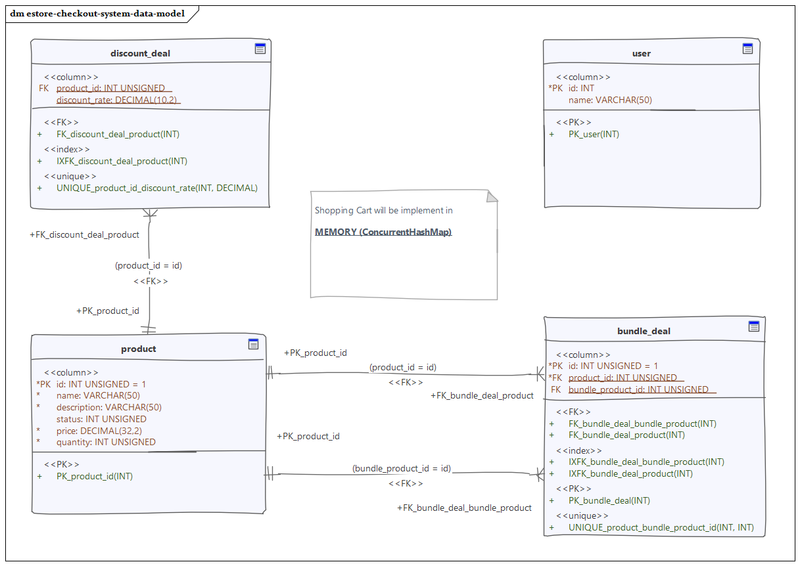
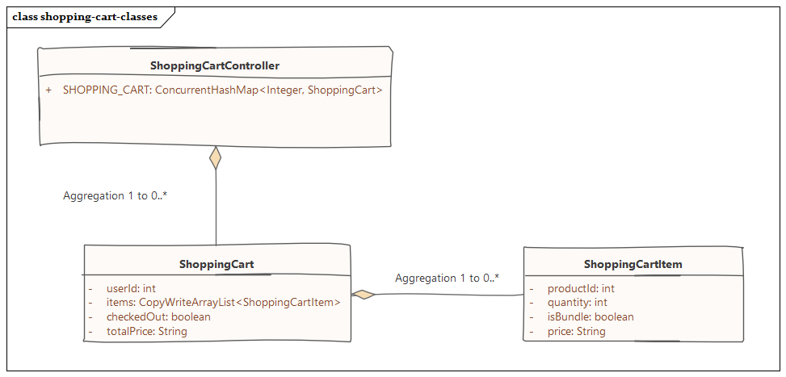

<H3> Setup Guide </H3>

1. Please install MySQL and run mysql_init.sql
2. Maven build the project.
3. Default open web-service with 8080 port.
4. Import the `estore-test.postman_collection` to Postman for automation test
5. Run the post-man collection

<H3> Noted </H3>

1. No session handling for the user/admin.
2. Add user to the `user` table manually. (Will add a default user by mysql_init.sql)
3. Shopping cart is implemented by internal memory instead of database table.


<H3> Data structure </H3>

<H5> Inventory Control and Checkout</H5>



<H5> Shopping Cart</H5>



 

<H3> API Spec. </H3>

<H5><u>1, Add new product</u> </H5>
POST - http://localhost:8080/product/add

```json
Request body:
{
    "name": "Mouse",
    "description": "A general Mouse for bundle deal",
    "status": 1,
    "quantity": 3,
    "price": 12
}
```
```json
Success case:
{
    "reason": null,
    "success": true
}
```

```json
Failed case:
{
    "reason": "can not add product, product->Product{id=0, name='TEST', description='TEST', status=1, quantity=3, price=12.0}",
    "success": false
}
```
---
<H5><u>2. Get a specifc product info</u> </H5>
GET - http://localhost:8080/product/info?id={product id}


```json
Success case:
{
    "id": 1,
    "name": "TEST2",
    "description": "TES2T",
    "status": 1,
    "quantity": 3,
    "price": 12.0
}
```

```json
Failed case:
{
    "reason": null,
    "data": null,
    "success": true
}
```
---
<H5><u>3. Get a product list</u> </H5>
GET - http://localhost:8080/product/list


```json
Success case:
[
    {
        "id": 0,
        "name": "Lenovo X230",
        "description": "A solid laptop with nice water proof keyboard",
        "status": 1,
        "quantity": 1,
        "price": 6500.0
    },
    {
        "id": 1,
        "name": "Mouse",
        "description": "A general Mouse for bundle deal",
        "status": 1,
        "quantity": 0,
        "price": 10.0
    }
]
```

```json
Failed case:
[]
```
---
<H5><u>4. Update product info</u> </H5>
PUT - http://localhost:8080/product/update

```json
Request body:
{
    "id": 0,
    "name": "Lenovo X230",
    "description": "A solid laptop with nice water proof keyboard",
    "status": 1,
    "quantity": 20,
    "price": 6500
}
```

```json
Success case:
{
    "reason": null,
    "data": {
        "id": 0,
        "name": "Lenovo X230",
        "description": "A solid laptop with nice water proof keyboard",
        "status": 1,
        "quantity": 20,
        "price": 6500.0
    },
    "success": true
}
```

```json
Failed case:
{
    "reason": "Product does not exist",
    "success": false
}
```
---
<H5><u>5. Add discount deal</u> </H5>
POST - http://localhost:8080/product/discount_deal/add

```json
Request body:
{
    "productId": 0,
    "discountRate": 0.5
}
```

```json
Success case:
{
    "reason": "",
    "success": true
}
```

```json
Failed case:
{
    "reason": "can not add discount deal, params->DiscountDeal{productId=5, discountRate=0.5}",
    "success": false
}
```
---
<H5><u>6. Add bundle deal</u> </H5>
POST - http://localhost:8080/product/bundle_deal/add

```json
Request body:
{
    "productId": 0,
    "bundleProductId": 1
}
```

```json
Success case:
{
    "reason": "",
    "success": true
}
```

```json
Failed case:
{
    "reason": "can not add bundle deal, params->BundleDeal{id=0, productId=0, bundleProductId=14}",
    "success": false
}
```
---
<H5><u>7. Add item shopping cart</u> </H5>
POST - http://localhost:8080/shopping-cart/{user id}/add

```json
Request body:
{
    "productId": 1,
    "quantity":1
}
```

```json
Success case:
{
    "reason": "",
    "success": true
}
```

```json
Error cases:
1. Product quantity is insufficient on stock
{
    "reason": "Product quantity is insufficient on stock",
    "success": false
}
2. Product does not exist
{
    "reason": "Product does not exist",
    "success": false
}
3. User does not exist
{
    "reason": "User does not exist",
    "success": false
}
---
```
<H5><u>8. Remove item shopping cart</u> </H5>
DELETE - http://localhost:8080/shopping-cart/{user id}/remove

```json
Request body:
{
    "productId": 3
}
```

```json
Success case:
{
    "reason": "",
    "success": true
}
```

```json
Error cases:
1. Product does not exist
{
    "reason": "Product does not exist",
    "success": false
}
2. User does not exist
{
    "reason": "User does not exist",
    "success": false
}
```
---
<H5><u>9. Update from item shopping cart</u> </H5>
PUT - http://localhost:8080/shopping-cart/{user id}/update_quantity

```json
Request body:
{
    "productId": 4,
    "quantity": 1
}
```

```json
Success case:
{
    "reason": "",
    "success": true
}
```

```json
Error cases:
1. Product does not exist
{
    "reason": "Product does not exist",
    "success": false
}
2. User does not exist
{
    "reason": "User does not exist",
    "success": false
}
3. Failed to update quantity (Cart item does not exist)
{
    "reason": "Failed to update the product from shopping cart",
    "success": false
}
```
---
<H5><u>10. Check out</u> </H5>
POST - http://localhost:8080/shopping-cart/{user id}/check_out

> Noted:
> After checkout the shopping cart, the cart in concurrent hashmap will be removed.


```json
Success case:
{
    "reason": "",
    "data": {
        "userId": 10001,
        "items": [
            {
                "productId": "0",
                "quantity": 2,
                "isBundle": false,
                "price": "9750",
                "bundle": false
            },
            {
                "productId": "1",
                "quantity": 1,
                "isBundle": false,
                "price": "12",
                "bundle": false
            },
            {
                "productId": "1",
                "quantity": 2,
                "isBundle": true,
                "price": null,
                "bundle": true
            }
        ],
        "checkedOut": true,
        "totalPrice": "9762"
    },
    "success": true
}
```

```json
Error cases:
1. Product does not exist
{
    "reason": "Product does not exist",
    "success": false
}
2. User does not exist
{
    "reason": "User does not exist",
    "success": false
}
3. Shopping cart is empty
{
    "reason": "Shopping cart is empty",
    "success": false
}
```